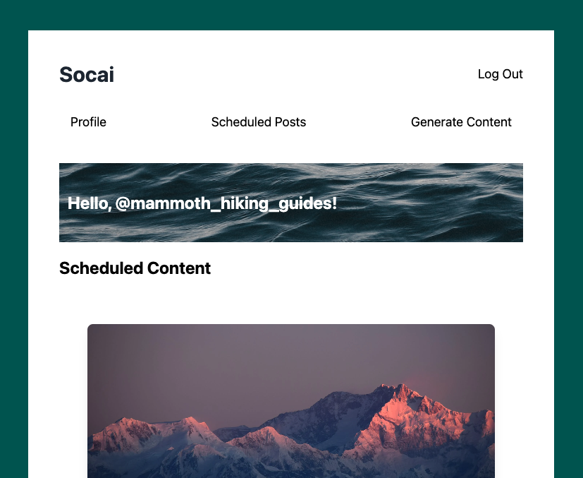

# SOCAI

Welcome to Socai! The best social media planning app for people who don't love social media. 

SOCAI is a web application that helps users generate caption content and suggested post dates for their social media profiles in order to save time and money. With SOCAI, users can schedule their social media posts and enter parameters about their social media goals to receive custom content. The app also allows users to view all of the generated content in order based on the schedule timeline, and view past posts if they’ve already been done. Users can create a profile about their business, input data about their social media account and their goals, and upload photos that they’ll post on social media with a brief description of what the content should look like.

## Screenshots




## Technologies Used

SOCAI is a MERN stack app and uses the following technologies:
- MongoDB
- Express.js
- React.js
- Node.js
- JSON Web Tokens
- OpenAi API 

## Installation Instructions 

To use SOCAI, you have the following options: 

1. Visit the following website: https://socai.herokuapp.com/. 

2. Fork and clone the repository to your local machine. 

3. Add an `.env` file in the root directory of the project containing the following API keys: 

   ```
   OPENAI_API_KEY=your-openai-api-key
   MONGODB_URI=your-mongodb-uri
   JWT_SECRET=your-jwt-secret
   ```

4. Install the required dependencies by running the following command in your terminal: 

   ```
   npm i
   ```

5. Start the application by running the following command in your terminal: 

   ```
   npm start
   ```

## User Stories

- As a user, I want to use an app that helps me generate social media content.
- As a user, I want to input an image and description to receive a suggested caption, hashtags, and scheduled date for my post.
- As a user, I want to view a timeline of all scheduled posts.
- As a user, I want the app to suggest high-quality captions and hashtags to help increase engagement on my social media accounts.
- As a user, I want the app to simplify the social media content creation and scheduling process to save me time and effort.
- As a user, I want the app to leverage the power of AI to help me create more effective social media content.

## Wireframes

View the wireframes on Figma: [SOCAI Wireframes](https://www.figma.com/file/Zg8KFrDKNQagcTZ4C50wnm/content-creator?node-id=0-1&t=IsiAQVmaqn1ERaDv-0)

## Unsolved Problems / Major Hurdles

- Creating an effective OpenAI prompt to generate social media content that accurately reflected users' inputs.
- Building the suggested schedule functionality
- Getting user data to render properly upon logging in
- Creating user model data and post input data that was effective in generating unique content without creating more work overall

## Next Steps

Improve landing page once user has logged in

Improve auth forms
- add messages for incorrect login info 
- login vs. signup nav bar 

Update forms to improve how this app is used. (i.e. add/remove user input options to generate better content for the user more easily)


Stretch goals: 
- Add Instagram API so users can use this app as a full scheduling app
- I would like to add analytics and reporting, which will allow users to track the performance of their social media profiles. 
- I'd also like to integrate multer so users do not need to use a url for image uploading. In addition to this I'd like to research photo generating APIs for users that do not have photo content to use. 
- Improve the UI. 

## Sources

- OpenAI:
  - [OpenAI npm package](https://www.npmjs.com/package/openai-api)
  - [OpenAI API documentation](https://platform.openai.com/docs/libraries)
- AI Help:
  - [YouTube video on OpenAI GPT-3](https://www.youtube.com/watch?v=_tYuhnlw7OU)
- Compact Camera icon by [Icons8](https://icons8.com/icon/85921/compact-camera) 